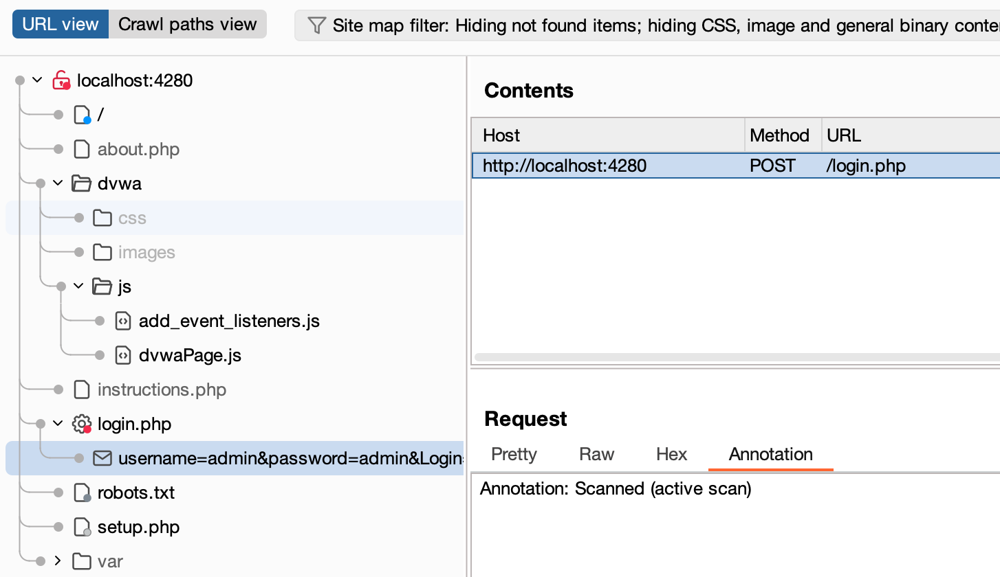
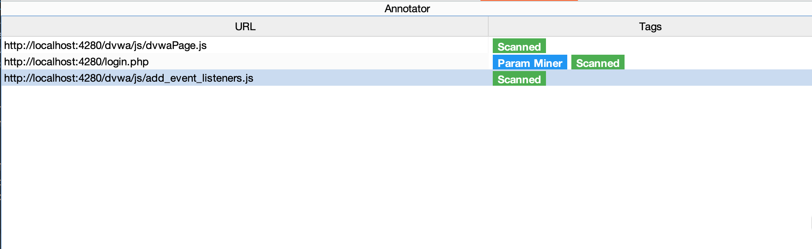

# Annotator

A Burp Suite extension that helps track which URLs have been scanned in the sitemap and when viewing individual requests.
Please note this is a work in progress. The limits of the montoya API have dictated several design decisions so we'll see where this takes me i've just needed to get this idea out. 

## Features

- Automatically track URLs that have been actively scanned
- View scan status in a custom editor tab
- Track active scan and other tool annotations





## Requirements

- Burp Suite Professional 2025.4 or later
- Java 17 or later

## Building

1. Download the Montoya API JAR from your Burp Suite installation
2. Compile the extension:
   ```bash
   javac -cp montoya-api-2025.4.jar --release 17 AnnotatorExtension.java
   ```
3. Create the JAR file:
   ```bash
   jar cfm SitemapAnnotator.jar META-INF/MANIFEST.MF AnnotatorExtension*.class
   ```

## Installation

1. Open Burp Suite
2. Go to Extensions > Installed
3. Click "Add"
4. Select "Java" as the extension type
5. Click "Select file" and choose the compiled JAR file
6. Click "Close"

## Usage

- Right-click on any URL in the sitemap and select "Send to Annotator" to manually add it to the table
- URLs that are actively scanned will be automatically marked
- View the scanned status in the "Annotation" tab when viewing a request

## Future Stuff
- Custom Tags
- More issues to help track more tags

## Notes

- Annotations are currently being tracked using a custom issue which will be visible in the sitemap
- The extension requires the Montoya API from Burp Suite Professional 
